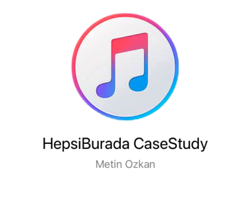
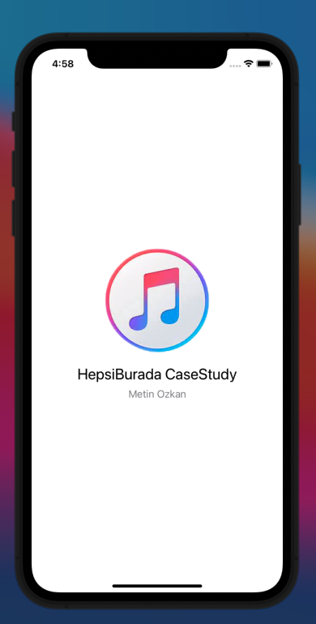
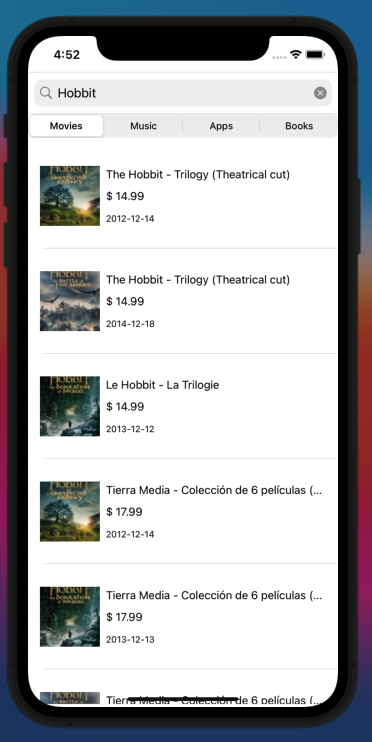
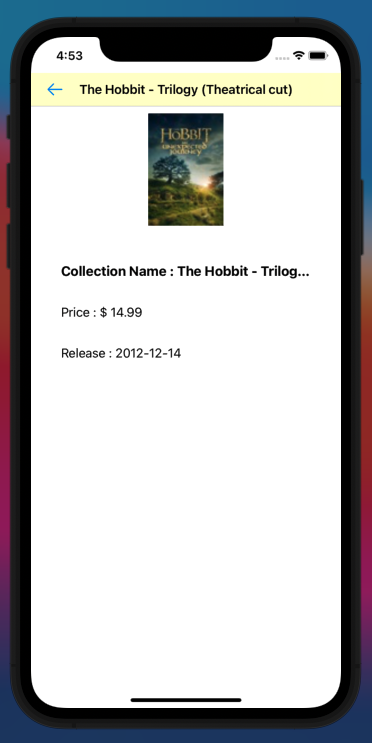
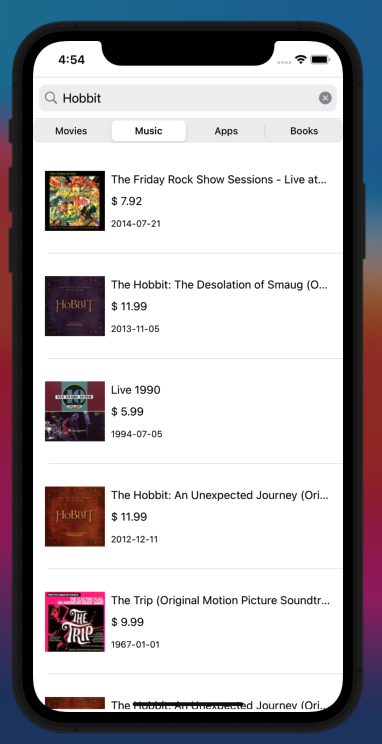
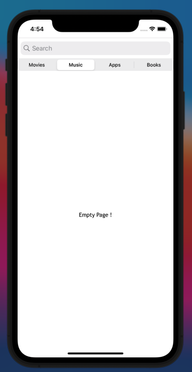

<!-- PROJECT LOGO -->
<br />
<div align="center">
  <a href="https://github.com/metinozkan/HepsiburadaCaseStudy">
    
  </a>

  <h3 align="center">HepsiBurada Itunes CaseStudy</h3>

</div>

<!-- ABOUT THE PROJECT -->

## About The Project

This app searches when you want to find a movie series, music, app and book. You can tap one of the search items and you can know details about tapped items.

### Built With

- [Swift](https://swift.org/)
- [Alamofire](https://github.com/Alamofire/Alamofire)
- [SDWebImage](https://github.com/SDWebImage/SDWebImage)
- [HLBarIndicatorView](https://github.com/pandaApe/HLBarIndicatorView)

<!-- GETTING STARTED -->

## Getting Started

### Prerequisites

- pod
  ```sh
  sudo gem install cocoapods
  ```

### Installation

1. Clone the repo
   ```sh
   git clone https://github.com/metinozkan/HepsiburadaCaseStudy.git
   ```
2. Install pod packages
   ```sh
   pod install
   ```

## ScreenShots

<div align="left" style="margin-bottom:1em">
   
    
    
    
    
</div>

## ScreenRecorder


<!-- CONTACT -->

## Contact

Metin özkan - metin.ozkn@hotmail.com - https://github.com/metinozkan

Project Link: [https://github.com/metinozkan/HepsiburadaCaseStudy](https://github.com/metinozkan/HepsiburadaCaseStudy)
